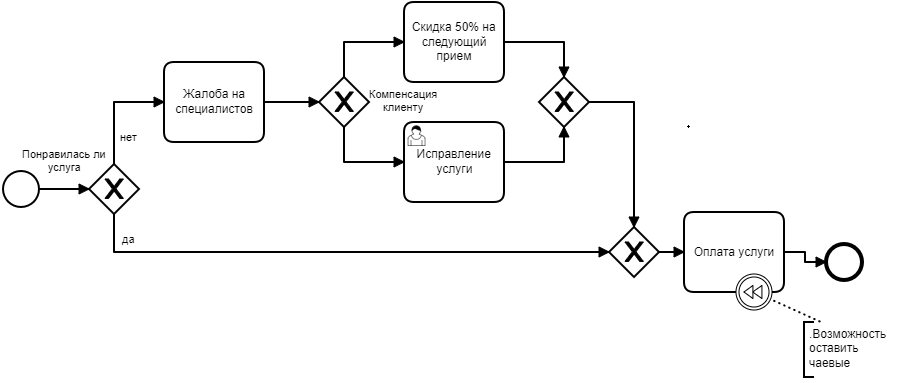

 ## Введение

Сегодня салоны красоты стали неотъемлемой частью нашего быта, существует огромное число салонов красоты и предлагаемых ними услуг.

Предприятия индустрии красоты имеют характерные отличительные признаки, определяющие их класс, тип и направление. Это определяет ценовую политику организации, загруженность клиентами, правила поведения в коллективе и количество специалистов, подбор используемых методик и другие параметры салонного бизнеса. Услуги красивого бизнеса должны отвечать требованиям, общим для всех организаций, оказывающих эти услуги. Обязательными из них являются: высокое качество оказания услуг; эффективность той или иной процедуры; квалификация специалистов и мастеров оказывающих услуги.
## 1  Описание предметной области

## 1.1 Исследование предметной области

Салон красоты арендует площадь 125 кв. метров. Помещение включает: зону ресепшн с гардеробом и стойкой администратора (11 кв. м.), парикмахерский зал (26 кв. м.), помещение для мытья, окраски, завивки волос (12 кв. м.), зона для визажа и наращивания ресниц (8 кв. м.), кабинет маникюра и педикюра (12 кв. м.), косметический кабинет (12 кв. м.), массажный кабинет (16 кв. м.), солярий (15 кв. м.), подсобное помещение для хранения дезинфицирующих средств (3 кв. м.), комната отдыха (10 кв. м.).

Основными услугами салона красоты являются:

Парикмахерские услуги (мужская, женская, детская стрижка);

- Маникюр и педикюр (уход, наращивание, дизайн, коррекция);
- Косметологические услуги (уход за кожей и чистка лица, уход за бровями, уход за ресницами, эпиляция, демакияж, пилинг);
- Уход за кожей тела;
- Солярий;
- Продажа косметических средств.

## 1.2 Анализ предметов моделирования
 В процессе работа   парикмахерской участвует весь персонал и клиенты. Все начинается с того, что клиент выбирает услугу и специалиста. Затем происходит запись на прием. После этого клиент пользуется услугой салона и далее происходит оплата данной услуги.
#
#
#

 ## 1.3 Создание BPMN модели.
BPMN (англ. Business Process Model and Notation, нотация и модель бизнес-процессов) система условных обозначений (нотация) и их описания в XML для моделирования бизнес-процессов.

Концепция BPMN.

Спецификация BPMN описывает условные обозначения и их описание в XML для отображения бизнес-процессов в виде диаграмм бизнес-процессов. BPMN ориентирована как на технических специалистов, так и на бизнес-пользователей. Для этого язык использует базовый набор интуитивно понятных элементов, которые позволяют определять сложные семантические конструкции. Кроме того, спецификация BPMN определяет, как диаграммы, описывающие бизнес-процесс, могут быть трансформированы в исполняемые модели. Спецификация BPMN 2.0 также является исполняемой и переносимой (то есть процесс, нарисованный в одном редакторе от одного производителя, может быть исполнен на движке бизнес-процессов совершенно другого производителя, при условии, что они поддерживают BPMN 2.0).

Основная цель BPMN — создание стандартного набора условных обозначений, понятных всем бизнес-пользователям. Бизнес-пользователи включают в себя бизнес-аналитиков, создающих и улучшающих процессы, технических разработчиков, ответственных за реализацию процессов и менеджеров, следящих за процессами и управляющих ими. Следовательно, BPMN призвана служить связующим звеном между фазой дизайна бизнес-процесса и фазой его реализации.

В настоящий момент существует несколько конкурирующих стандартов для моделирования бизнес-процессов. Распространение BPMN поможет унифицировать способы представления базовых концепций бизнес-процессов (например, открытые и частные бизнес-процессы, хореографии), а также более сложные концепции (например, обработка исключительных ситуаций, компенсация транзакций).

Знаки, использующиеся в модели:

Начало		Конец** 		     Шлюз (или)  		            Таймер**            
			

Моделирование бизнес-процессов используется для донесения широкого спектра информации до различных категорий пользователей. Диаграммы бизнес-процессов позволяют описывать сквозные бизнес-процессы, но в то же время помогают читателям быстро понимать процесс и легко ориентироваться в его логике.

**BPMN-модель
## Основной бизнес-процесс парикмахерской (см. рис. 1.)

Рисунок 1

## Подпроцесс «Воспользоваться услугой»

Тут мы рассмотрим более подробно подпроцесс «Воспользоваться услугой». Все начинается с того что, задерживается специалист которого выбрал клиент, отсутствует или он на месте. Если специалист сегодня отсутствует, то услуга клиента переносится на другой день, если же специалист задерживается, клиенту предлагают его подождать, или же специалист на рабочем месте, то дальше выполняется  услуга которую выбрал клиент. (см рис. 2)

Рисунок 2

## 3. Подпроцесс «Оценки услуги»

Ситуация когда клиенту не понравилась услуга. Клиент подает жалобу на специалиста. Далее клиенту предлагают скидку на следующий прием в размере 50% или же исправление проделанной услуги. (см. рис. 3).

Рисунок 3

## 4 Use case модель

Диаграмма вариантов использования

Диаграмма прецедентов или диаграмма вариантов использования в UML — диаграмма, отражающая отношения между акторами и прецедентами и являющаяся составной частью модели прецедентов, позволяющей описать систему на концептуальном уровне. 

Use case модель (рисунок 4)

Рисунок 4 – Use case модель

## 1.4 Проблематика предметной области

Главной проблемой являются большие трудозатраты сотрудников на ведение учета работы салона, что может привести к появлению ошибок.

